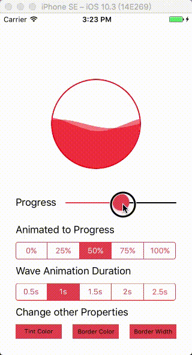
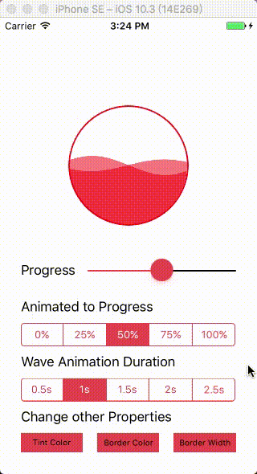
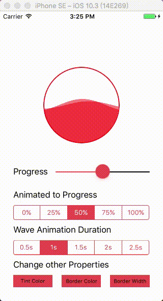
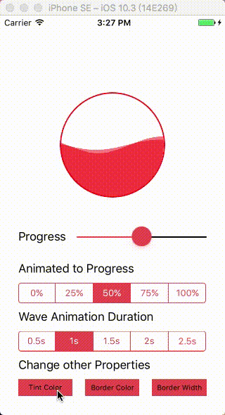

 


[ENGLISH](README_EN.md)
#### `LKAWaveCircleProgressBar` 是一款带有双波浪动画的圆形进度指示器视图，可自定义圆形容器的`边框颜色`、`边框线宽`，双波浪的`颜色`，`动画时间`，进度改变`时间`。

## 截图
|设置进度|动画设置进度|设置波浪动画时间|
|:---:|:---:|:---:|
||||
|设置其他属性|
||
## 安装
#### CocoaPods
1、在 Podfile 文件中添加
```
pod 'LKAWaveCircleProgressBar'
```
2、执行
```
pod install
```
3、在你需要使用的地方导入头文件
```
#import "LKAWaveCircleProgressBar.h"
```
#### 手动安装
1、下载最新代码

2、将`WaveAnimation/LKAWaveCircleProgressBar`文件夹拖动到 Xcode 工程项目中。确保选中 `Copy items if needed`。

3、导入头文件使用
```
#import <LKAWaveCircleProgressBar.h>
```
## 使用方法
#### 初始化，可以使用 Autolayout 或者设置指定 frame 来定义视图的大小位置。⚠️`确保视图的高和宽一样`
```
LKAWaveCircleProgressBar *wcView = [[LKAWaveCircleProgressBar alloc] initWithFrame:CGRectMake(0, 0, 150, 150)];
```
#### 设置指示器 progress, 取值范围为 [0, 1]
```
// 无动画效果设置方法
self.wcView.progress = value;
// 或者
[self.wcView setProgress:value];
// 或者
[self.wcView setProgress:value animated:NO];

// 有动画效果设置方法
[self.wcView setProgress:value animated:YES];
```
#### 视图属性定制化，详细使用方法可以查看 [WaveAnimation/TestViewContorller.m](WaveAnimation/TestViewContorller.m)
```
// 双波浪滚动动画时间，默认值：1秒
@property (nonatomic, assign) NSTimeInterval waveRollingDuration;
// 进度改变动画时间，默认值：1秒
@property (nonatomic, assign) NSTimeInterval progressAnimationDuration;
// 波浪颜色，默认值：[UIColor colorWithRed:1.0 green:0.0 blue:0.0 alpha:0.5]
@property(nonatomic, strong) UIColor *progressTintColor;
// 指示器圆形容器边框颜色，默认值：[UIColor colorWithRed:1.0 green:0.0 blue:0.0 alpha:0.9]
@property (nonatomic, strong) UIColor *borderColor;
// 指示器圆形容器边框线宽，默认值：2.0
@property (nonatomic, assign) CGFloat borderWidth;
// 进度改变动画完成后回调 Block，默认值为空，主线程执行 block。
@property (nonatomic, copy) Completion completion;
// 停止波浪滚动效果
- (void)stopWaveRollingAnimation;
// 开始波浪滚动效果
- (void)startWaveRollingAnimation;
```

## License
LKAWaveCircleProgressBar is released under the [MIT license](LICENSE). See LICENSE for details.

